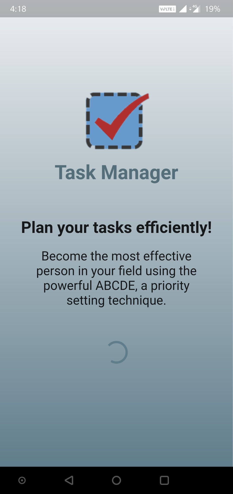
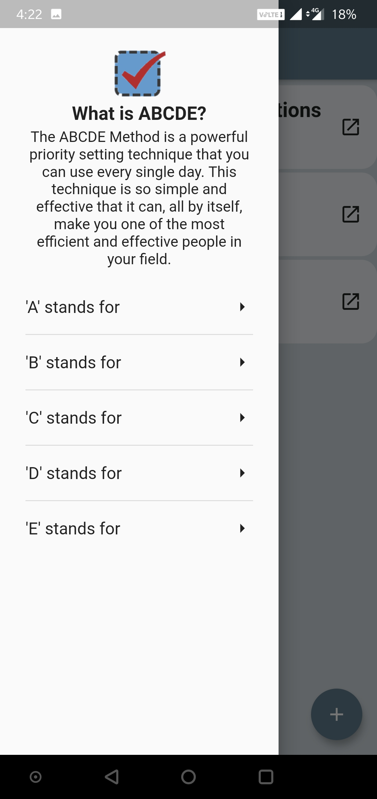
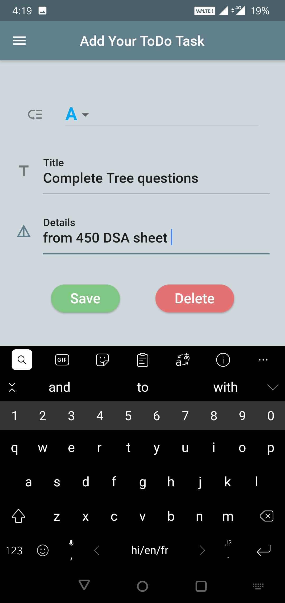
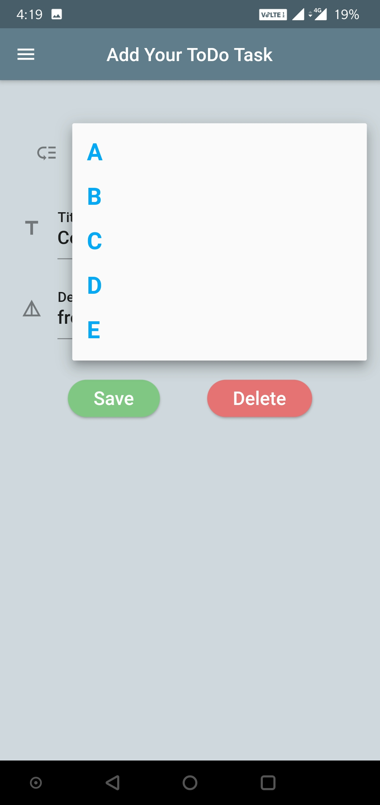
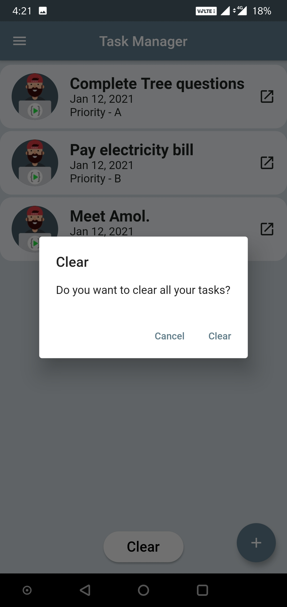
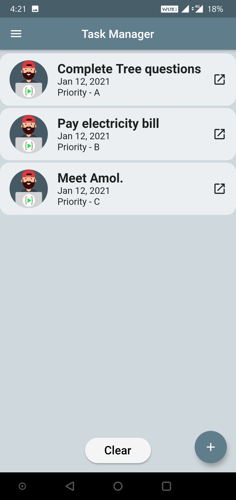

# Task Manager - ABCDE

My First Flutter project. 

**What is ABCDE?** 
The ABCDE Method is a powerful priority setting technique that you can use every single day. This technique is so simple and effective that it can, all by itself, make you one of the most efficient and effective people in your field.

# Screenshots :

&nbsp;&nbsp;&nbsp;
&nbsp;&nbsp;&nbsp;
 
&nbsp;&nbsp;&nbsp;
&nbsp;&nbsp;&nbsp;

My Profiles :

- [LinkedIn](https://www.linkedin.com/in/yash-varshney/)
- [Codeforces](https://codeforces.com/profile/__ykji)
